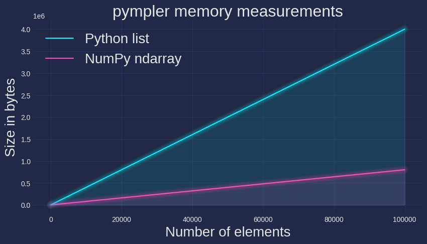

# NumPy Tutorial

This repository provides a simple introduction to NumPy.

## What and why NumPy
NumPy is the fundamental package in Python for numerical computing, offering significant advantages in performance and memory efficiency. Its arrays are implemented in C, enabling faster execution compared to native Python lists.

NumPy uses contiguous memory allocation and supports vectorized operations, reducing the need for explicit Python loops and minimizing overhead.

<p align="center">
  
</p>

Additionally, its optimized memory management and ability to handle large datasets efficiently make it an essential tool for scientific computing, data analysis, and machine learning.

<p align="center">
  
</p>


## Contents

Each lesson is contained in a single jupyter notebook.

1. [Array creation](notebooks/0_array_creation.ipynb)
1. [Data access](notebooks/1_array_data_access.ipynb)
1. [Shape manipulation](notebooks/2_array_shape_manip.ipynb)
1. [Operations on arrays](notebooks/3_array_ops.ipynb)
1. [Advanced indexing and masking](notebooks/4_advanced_indexing_and_masking.ipynb)
1. [Views and copies](notebooks/5_views_and_copies.ipynb)
1. [Random numbers](notebooks/6_random_numbers.ipynb)


## How do I use this repo?

You need to install `numpy` and `jupyter notebook`. Using `pip` as package manager:

```bash
pip install numpy jupyter notebook
```

Then, clone the repository and open its contents with your favourite code editor.

```bash
git clone https://github.com/Xylambda/numpy_tutorial.git
```

Read notebooks in order and execute cells one at a time, studying the output as well as the code.